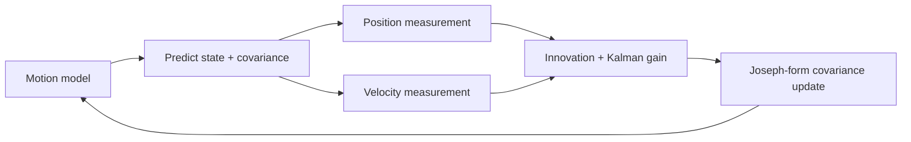

# EKF Sensor Fusion Lab

A compact, testable 2D state-estimation laboratory for fusing noisy position and velocity measurements. The implementation favors readable mathematics, numerical stability, and deterministic verification over framework-specific code.

> All measurements and trajectories are synthetic. This independent portfolio project does not contain or reproduce employer code, maps, logs, or operational data.

## Estimation loop



The state is `[x, y, vx, vy]`. Position and velocity sensors can update at different rates, which mirrors a common robotics integration pattern.

## Quick start

```bash
python -m venv .venv
source .venv/bin/activate
python -m pip install -e .
ekf-demo
python -m unittest discover -s tests -v
```

The demo prints raw measurement RMSE, filtered RMSE, and percentage improvement for a seeded synthetic trajectory.

## Engineering choices

- Explicit transition, observation, and process-noise matrices.
- Linear solve instead of a direct matrix inverse.
- Joseph-form covariance update with a symmetry guard.
- Reproducible simulation and unit tests.
- Small surface area that is easy to port into ROS2 nodes or embedded services.
