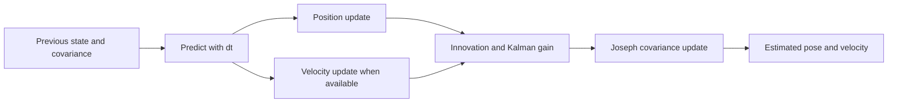

# EKF Sensor Fusion Lab

[](https://github.com/Parth-Oza/ekf-sensor-fusion-lab/actions/workflows/test.yml)
[](https://www.python.org/)
[](LICENSE)

A compact, testable state-estimation laboratory for fusing noisy position and velocity measurements in two dimensions. The implementation favors readable mathematics, deterministic experiments, and numerical stability over framework-specific abstractions.

> All measurements and trajectories are synthetic. This independent portfolio project contains no employer code, maps, logs, sensor calibration, or operational data.

## Capabilities

- Tracks the state vector `[x, y, vx, vy]` with a constant-velocity motion model.
- Supports asynchronous position and velocity measurement updates.
- Builds process noise from acceleration variance and elapsed time.
- Uses a linear solve instead of an explicit matrix inverse.
- Applies the Joseph covariance update and a symmetry guard.
- Includes seeded simulation, RMSE reporting, validation, and regression tests.



## Quick start

```bash
python -m venv .venv
source .venv/bin/activate
python -m pip install -e .
ekf-demo
python -m unittest discover -s tests -v
```

The demo prints raw position RMSE, filtered position RMSE, and improvement percentage for a seeded synthetic trajectory.

## Library usage

```python
from ekf_sensor_fusion import ConstantVelocityEKF

filter_ = ConstantVelocityEKF(acceleration_variance=0.2)
filter_.predict(dt=0.1)
filter_.update_position([1.3, -0.2], variance=0.64)
filter_.update_velocity([1.1, -0.3], variance=0.0324)

print(filter_.state)
print(filter_.covariance)
```

`dt` and measurement variance must be positive. Position and velocity measurements must each contain two values.

## Project layout

```text
src/ekf_sensor_fusion/ekf.py         Filter state, prediction, and updates
src/ekf_sensor_fusion/simulation.py  Seeded synthetic experiment and CLI
tests/test_ekf.py                    Numerical and validation tests
docs/ARCHITECTURE.md                 Mathematical model and extension notes
```

## Engineering principles

- Make state, covariance, and noise assumptions visible.
- Prefer deterministic simulation over visually impressive but irreproducible demos.
- Test numerical properties and invalid inputs.
- Keep ROS2 and hardware adapters outside the mathematical core.

See [Architecture](docs/ARCHITECTURE.md), [Contributing](CONTRIBUTING.md), and [Security](SECURITY.md).

## Contact

For professional opportunities and technical discussions: [ozaparthu055@gmail.com](mailto:ozaparthu055@gmail.com) · [Portfolio](https://parthoza.net) · [LinkedIn](https://www.linkedin.com/in/oza-parth)
